# 📚 Online Book Store

<div align="center">


**A production-ready full-stack application with complete CI/CD automation**

[Features](#-features) • [Architecture](#-architecture) • [Pipeline](#-jenkins-cicd-pipeline) • [Screenshots](#-application-screenshots) • [Getting Started](#-getting-started)

</div>

---

## 🎯 Project Overview

**Online Book Store** is a comprehensive full-stack Spring Boot application showcasing modern DevOps practices. The project features automated CI/CD pipelines, containerized deployment, code quality analysis, and security scanning. Built with enterprise-grade tools and deployed on AWS infrastructure, this project demonstrates real-world software delivery automation.

### 🎓 Key Objectives

<table>
<tr>
<td width="50%">

**Development**
- ✅ RESTful API architecture
- ✅ MySQL database integration
- ✅ Spring Boot best practices
- ✅ Maven build automation

</td>
<td width="50%">

**DevOps & Operations**
- ✅ Complete CI/CD automation
- ✅ Docker containerization
- ✅ Security vulnerability scanning
- ✅ Automated deployment pipeline

</td>
</tr>
</table>

---

## ✨ Features


### Application Features

- 📖 **Book Management** - Browse, search, and manage book inventory
- 👤 **User Authentication** - Secure registration and login system
- 🛒 **Shopping Cart** - Add books to cart and manage orders
- 📊 **User Dashboard** - Personal profile and order history
- 🔐 **Role-Based Access** - Admin and user role management
- 📱 **Responsive UI** - Mobile-friendly interface

### DevOps Features

- 🔄 **Automated CI/CD** - Complete Jenkins pipeline automation
- 🐳 **Docker Deployment** - Containerized application deployment
- 📈 **Code Quality** - Continuous SonarQube analysis
- 🔒 **Security Scanning** - Trivy vulnerability detection
- 📧 **Email Notifications** - Build and deployment alerts
- 🚀 **Zero-Downtime Deployment** - Rolling container updates

---

## 🏗️ Architecture

### System Architecture

```mermaid
%%{init: {'theme':'base', 'themeVariables': { 'primaryColor':'#6DB33F','primaryTextColor':'#fff','primaryBorderColor':'#4E9816','lineColor':'#495057','secondaryColor':'#2496ED','tertiaryColor':'#D24939'}}}%%
graph TB
    subgraph Client["👥 Client Layer"]
        WEB[🌐 Web Browser]
    end
    
    subgraph Application["🖥️ Application Layer - AWS EC2"]
        DOCKER[🐳 Docker Container<br/>Port: 8081]
        APP[📦 Spring Boot App<br/>Java 17]
        DOCKER --> APP
    end
    
    subgraph Database["💾 Database Layer"]
        MYSQL[(🗄️ MySQL 8.0<br/>Port: 3306)]
    end
    
    subgraph DevOps["🔧 DevOps Platform"]
        JENKINS[⚙️ Jenkins<br/>CI/CD Server]
        SONAR[📊 SonarQube<br/>Code Quality]
        TRIVY[🔒 Trivy<br/>Security Scan]
        DOCKER_HUB[🐋 Docker Hub<br/>Registry]
    end
    
    WEB -->|HTTP :8081| DOCKER
    APP -->|JDBC| MYSQL
    JENKINS -->|Build & Deploy| DOCKER
    JENKINS -->|Analyze| SONAR
    JENKINS -->|Scan| TRIVY
    JENKINS -->|Push/Pull| DOCKER_HUB
    
    style Client fill:#e3f2fd,stroke:#2196f3,stroke-width:3px
    style Application fill:#e8f5e9,stroke:#4caf50,stroke-width:3px
    style Database fill:#fff3e0,stroke:#ff9800,stroke-width:3px
    style DevOps fill:#fce4ec,stroke:#e91e63,stroke-width:3px
```



### Technology Stack

<div align="center">

| Layer | Technology | Purpose | Version |
|-------|-----------|---------|---------|
| **Backend Framework** |  | Application framework | 3.0+ |
| **Programming Language** |  | Backend development | 17 |
| **Database** |  | Data persistence | 8.0 |
| **Build Tool** |  | Dependency management | 3.8+ |
| **CI/CD** |  | Automation server | 2.400+ |
| **Code Quality** |  | Static code analysis | 9.9+ |
| **Security Scan** |  | Vulnerability scanner | Latest |
| **Containerization** |  | Container platform | 24.0+ |
| **Cloud Platform** |  | Infrastructure | EC2 |
| **Version Control** |  | Source control | - |

</div>

---

## 🔄 Jenkins CI/CD Pipeline

### Pipeline Overview

<div align="center">


</div>

### Pipeline Flow


### Pipeline Stages Detailed


### Pipeline Stages Breakdown

<table>
<tr>
<th>Stage</th>
<th>Description</th>
<th>Tools</th>
<th>Output</th>
</tr>
<tr>
<td><b>1. Checkout</b></td>
<td>Pull latest code from GitHub repository</td>
<td>Git, Jenkins SCM</td>
<td>Source code</td>
</tr>
<tr>
<td><b>2. Compile</b></td>
<td>Compile Java source code</td>
<td>Maven</td>
<td>Compiled classes</td>
</tr>
<tr>
<td><b>3. Test</b></td>
<td>Execute unit tests</td>
<td>JUnit, Maven Surefire</td>
<td>Test reports</td>
</tr>
<tr>
<td><b>4. SonarQube Analysis</b></td>
<td>Static code analysis for bugs, vulnerabilities, code smells</td>
<td>SonarQube Scanner</td>
<td>Quality metrics</td>
</tr>
<tr>
<td><b>5. Package</b></td>
<td>Build executable JAR file</td>
<td>Maven</td>
<td>application.jar</td>
</tr>
<tr>
<td><b>6. Docker Build</b></td>
<td>Create Docker image from Dockerfile</td>
<td>Docker</td>
<td>Container image</td>
</tr>
<tr>
<td><b>7. Push to Registry</b></td>
<td>Upload image to Docker Hub</td>
<td>Docker Hub</td>
<td>Published image</td>
</tr>
<tr>
<td><b>8. Trivy Scan</b></td>
<td>Security vulnerability scanning</td>
<td>Trivy</td>
<td>Security report</td>
</tr>
<tr>
<td><b>9. Deploy</b></td>
<td>Deploy container on EC2 instance</td>
<td>Docker, SSH</td>
<td>Running container</td>
</tr>
<tr>
<td><b>10. Notify</b></td>
<td>Send email notification</td>
<td>Jenkins Email Extension</td>
<td>Email alert</td>
</tr>
</table>

---

## 🔒 Security & Quality

### Code Quality Metrics


### Security Scanning

```mermaid
graph TD
    A[🐳 Docker Image] --> B[🔒 Trivy Scanner]
    B --> C{Vulnerabilities?}
    C -->|Critical/High| D[❌ Fail Build]
    C -->|Low/Medium| E[⚠️ Warning]
    C -->|None| F[✅ Pass]
    
    D --> G[📧 Alert Team]
    E --> H[📝 Log Report]
    F --> I[🚀 Deploy]
    
    style B fill:#1904DA,color:#fff
    style D fill:#dc3545,color:#fff
    style F fill:#28a745,color:#fff
```



**Trivy Scan Coverage:**
- OS packages vulnerabilities
- Application dependencies (Maven)
- Known CVEs in base images
- Misconfiguration detection

---

## 📱 Application Screenshots

<div align="center">

### 🏠 Home Page


*Modern landing page with featured books and navigation*

---

### 👤 User Authentication

<table>
<tr>
<td width="50%">
<h4>📝 User Registration</h4>

<p><i>Secure user registration with validation</i></p>
</td>
<td width="50%">
<h4>🔐 User Login</h4>

<p><i>Authentication with session management</i></p>
</td>
</tr>
</table>

---

### 📚 Book Management

<table>
<tr>
<td width="50%">
<h4>📖 Browse Books</h4>

<p><i>Comprehensive book catalog with search</i></p>
</td>
<td width="50%">
<h4>👨‍💼 User Profile</h4>

<p><i>Personal profile and account settings</i></p>
</td>
</tr>
</table>

---

### 📊 User Dashboard


*Personalized dashboard with order history and recommendations*

</div>

---

## 🚀 Getting Started

### Prerequisites

```mermaid
graph LR
    A[☁️ AWS EC2 Instance] --> B[🐳 Docker Installed]
    B --> C[⚙️ Jenkins Setup]
    C --> D[🗄️ MySQL Database]
    D --> E[🔑 Credentials Configured]
    
    style A fill:#FF9900,color:#fff
    style E fill:#28a745,color:#fff
```

<div align="center">



</div>

**Required Tools:**
- AWS EC2 instance (t2.medium or higher recommended)
- Docker 24.0+ installed on EC2
- Jenkins 2.400+ with required plugins
- MySQL 8.0+ (accessible from EC2)
- GitHub account with repository
- Docker Hub account

**Jenkins Plugins Required:**
- Git Plugin
- Maven Integration
- Docker Pipeline
- SonarQube Scanner
- Email Extension Plugin
- Pipeline

---

### 🔧 Local Development Setup

#### Step 1: Clone Repository

```bash
# Clone the project
git clone https://github.com/Saifudheenpv/Online-Book-Store.git
cd Online-Book-Store
```

#### Step 2: Configure Database

```bash
# Create MySQL database
mysql -u root -p
CREATE DATABASE bookstore;
CREATE USER 'bookuser'@'%' IDENTIFIED BY 'bookpass';
GRANT ALL PRIVILEGES ON bookstore.* TO 'bookuser'@'%';
FLUSH PRIVILEGES;
```

#### Step 3: Update Application Configuration

Edit `src/main/resources/application.properties`:

```properties
# Database Configuration
spring.datasource.url=jdbc:mysql://<EC2-private-ip>:3306/bookstore
spring.datasource.username=bookuser
spring.datasource.password=bookpass
spring.datasource.driver-class-name=com.mysql.cj.jdbc.Driver

# JPA Configuration
spring.jpa.hibernate.ddl-auto=update
spring.jpa.show-sql=true
spring.jpa.properties.hibernate.dialect=org.hibernate.dialect.MySQL8Dialect

# Server Configuration
server.port=8080
```

#### Step 4: Build with Maven

```bash
# Clean and package
mvn clean package -DskipTests

# Or with tests
mvn clean package
```

#### Step 5: Run with Docker

```bash
# Build Docker image
docker build -t saifudheenpv/online-book-store:latest .

# Run container
docker run -d \
  --name onlinebookstore \
  -p 8081:8080 \
  -e SPRING_DATASOURCE_URL=jdbc:mysql://<db-host>:3306/bookstore \
  -e SPRING_DATASOURCE_USERNAME=bookuser \
  -e SPRING_DATASOURCE_PASSWORD=bookpass \
  saifudheenpv/online-book-store:latest
```

#### Step 6: Access Application

```
🌐 Application: http://<EC2-public-ip>:8081
📊 Health Check: http://<EC2-public-ip>:8081/actuator/health
```

---

### ⚙️ Jenkins Setup

#### Jenkins Pipeline Configuration

```groovy
pipeline {
    agent any
    
    tools {
        maven 'maven3'
        jdk 'jdk17'
    }
    
    environment {
        DOCKER_IMAGE = 'saifudheenpv/online-book-store'
        SONAR_HOST = 'http://sonarqube-server:9000'
    }
    
    stages {
        stage('Checkout') {
            steps {
                git branch: 'main', 
                    url: 'https://github.com/Saifudheenpv/Online-Book-Store.git'
            }
        }
        
        stage('Compile') {
            steps {
                sh 'mvn compile'
            }
        }
        
        stage('Test') {
            steps {
                sh 'mvn test'
            }
        }
        
        stage('SonarQube Analysis') {
            steps {
                withSonarQubeEnv('sonarqube') {
                    sh 'mvn sonar:sonar'
                }
            }
        }
        
        stage('Build') {
            steps {
                sh 'mvn clean package -DskipTests'
            }
        }
        
        stage('Docker Build & Push') {
            steps {
                script {
                    docker.withRegistry('https://registry.hub.docker.com', 'docker-creds') {
                        def app = docker.build("${DOCKER_IMAGE}:${BUILD_NUMBER}")
                        app.push()
                        app.push('latest')
                    }
                }
            }
        }
        
        stage('Trivy Scan') {
            steps {
                sh "trivy image ${DOCKER_IMAGE}:${BUILD_NUMBER}"
            }
        }
        
        stage('Deploy') {
            steps {
                sh '''
                    docker stop onlinebookstore || true
                    docker rm onlinebookstore || true
                    docker run -d --name onlinebookstore -p 8081:8080 ${DOCKER_IMAGE}:latest
                '''
            }
        }
    }
    
    post {
        success {
            emailext (
                subject: "✅ Build Success: ${env.JOB_NAME} - ${env.BUILD_NUMBER}",
                body: "The build completed successfully.",
                to: 'your-email@example.com'
            )
        }
        failure {
            emailext (
                subject: "❌ Build Failed: ${env.JOB_NAME} - ${env.BUILD_NUMBER}",
                body: "The build has failed. Please check Jenkins console.",
                to: 'your-email@example.com'
            )
        }
    }
}
```

---

## 📧 Email Notifications

### Notification Configuration

```mermaid
graph LR
    A[Jenkins Build] --> B{Build Status}
    B -->|Success ✅| C[Success Email]
    B -->|Failure ❌| D[Failure Email]
    
    C --> E[📧 Gmail SMTP]
    D --> E
    
    E --> F[👨‍💻 Developer]
    E --> G[👥 Team]
    
    style C fill:#28a745,color:#fff
    style D fill:#dc3545,color:#fff
    style E fill:#0078D4,color:#fff
```



**Email Configuration in Jenkins:**

1. Navigate to: `Manage Jenkins` → `Configure System` → `Extended E-mail Notification`
2. Configure SMTP:
   ```
   SMTP Server: smtp.gmail.com
   SMTP Port: 465
   Use SSL: Yes
   Username: your-email@gmail.com
   Password: app-specific-password
   ```

**Notification Content:**
- ✅ **Success**: Build number, deployment status, application URL
- ❌ **Failure**: Error stage, console log link, remediation steps

---

## 🌐 AWS Deployment

### EC2 Instance Configuration

```mermaid
graph TB
    subgraph VPC["🏢 AWS VPC"]
        subgraph SG["🔒 Security Group"]
            A[Port 22 - SSH]
            B[Port 8081 - Application]
            C[Port 3306 - MySQL]
        end
        
        subgraph EC2["☁️ EC2 Instance"]
            D[Ubuntu 22.04 LTS]
            E[t2.medium]
            F[Docker Installed]
            G[Jenkins Agent]
        end
        
        SG --> EC2
    end
    
    H[👨‍💻 Developer] -->|SSH| A
    I[🌐 Users] -->|HTTP| B
    J[📦 Application] -->|JDBC| C
    
    style VPC fill:#FF9900,color:#fff
    style EC2 fill:#232F3E,color:#fff
```



**Instance Specifications:**
- **Instance Type**: t2.medium (2 vCPU, 4 GB RAM)
- **OS**: Ubuntu 22.04 LTS
- **Storage**: 30 GB gp3 SSD
- **Network**: Public subnet with Elastic IP

**Security Group Rules:**

| Type | Port | Source | Purpose |
|------|------|--------|---------|
| SSH | 22 | Your IP | Remote access |
| Custom TCP | 8081 | 0.0.0.0/0 | Application |
| MySQL | 3306 | VPC CIDR | Database |
| Jenkins | 8080 | Your IP | CI/CD access |

---

## 📚 Project Structure

```
online-book-store/
├── 📄 README.md
├── 📄 Dockerfile
├── 📄 pom.xml
├── 📄 Jenkinsfile
│
├── 📁 src/
│   ├── 📁 main/
│   │   ├── 📁 java/
│   │   │   └── 📁 com/bookstore/
│   │   │       ├── 📁 controller/       # REST Controllers
│   │   │       ├── 📁 model/            # Entity classes
│   │   │       ├── 📁 repository/       # Data access layer
│   │   │       ├── 📁 service/          # Business logic
│   │   │       └── 📁 config/           # Configuration
│   │   │
│   │   └── 📁 resources/
│   │       ├── application.properties   # App configuration
│   │       ├── 📁 static/               # CSS, JS, images
│   │       └── 📁 templates/            # HTML templates
│   │
│   └── 📁 test/                         # Unit tests
│
├── 📁 assets/                           # Documentation images
│   ├── DevOps-CI-CD-Project.png
│   ├── home.png
│   ├── login.png
│   └── ...
│
└── 📁 target/                           # Build output
    └── bookstore.jar
```

---

## 🧪 Testing

### Test Coverage


**Testing Strategy:**
- **Unit Tests**: Service and repository layer testing
- **Integration Tests**: Database and API integration
- **Maven Surefire**: Automated test execution
- **JaCoCo**: Code coverage reporting

```bash
# Run all tests
mvn test

# Run with coverage report
mvn clean test jacoco:report

# Skip tests during build
mvn clean package -DskipTests
```

---

## 📊 Monitoring & Logging


## 🔧 Troubleshooting

<details>
<summary><b>🐛 Common Issues & Solutions</b></summary>

### Issue 1: Database Connection Failed

```bash
# Check MySQL is running
systemctl status mysql

# Verify connection
mysql -h <host> -u bookuser -p

# Check application.properties
cat src/main/resources/application.properties
```

### Issue 2: Docker Container Not Starting

```bash
# Check container logs
docker logs onlinebookstore

# Verify image
docker images | grep online-book-store

# Check port availability
netstat -tulpn | grep 8081
```

### Issue 3: Jenkins Build Failing

```bash
# Check Jenkins logs
sudo journalctl -u jenkins -f

# Verify Maven installation
mvn -version

# Check Java version
java -version
```

### Issue 4: SonarQube Analysis Failed

```bash
# Verify SonarQube is running
curl http://sonarqube-server:9000

# Check authentication token
# In Jenkins: Manage Jenkins → Configure System → SonarQube servers
```

</details>

---

## 🎯 Best Practices Implemented


---

## 🚀 Performance Optimization

- **Database Indexing**: Optimized queries with proper indexes
- **Connection Pooling**: HikariCP for efficient database connections
- **Caching**: Spring Cache for frequently accessed data
- **Lazy Loading**: JPA lazy loading for better performance
- **Docker Optimization**: Multi-stage builds for smaller images

---

## 📈 Future Enhancements


### Planned Features

- [ ] **Payment Gateway Integration** - Razorpay/Stripe
- [ ] **Book Recommendation System** - ML-based recommendations
- [ ] **Advanced Search** - Elasticsearch integration
- [ ] **Microservices Architecture** - Service decomposition
- [ ] **Kubernetes Deployment** - Container orchestration
- [ ] **API Gateway** - Spring Cloud Gateway
- [ ] **Service Mesh** - Istio integration
- [ ] **Mobile App** - React Native/Flutter
- [ ] **Real-time Notifications** - WebSocket integration
- [ ] **Analytics Dashboard** - Business intelligence

---

## 🤝 Contributing

Contributions are welcome! Please follow these steps:

1. **Fork the Repository**
2. **Create Feature Branch**: `git checkout -b feature/AmazingFeature`
3. **Commit Changes**: `git commit -m 'Add AmazingFeature'`
4. **Push to Branch**: `git push origin feature/AmazingFeature`
5. **Open Pull Request**

### Contribution Guidelines

- Follow Java coding conventions
- Write unit tests for new features
- Update documentation
- Ensure CI/CD pipeline passes

---

## 📝 License

This project is licensed under the MIT License - see the [LICENSE](LICENSE) file for details.

---

## 👤 Author

<div align="center">

### **Saifudheen PV**

**Full-Stack Developer | DevOps Engineer | Cloud Enthusiast**

[](https://github.com/Saifudheenpv)
[](https://linkedin.com/in/yourprofile)
[](mailto:your.email@example.com)
[](https://yourportfolio.com)

**Tech Stack Expertise:**
- ☕ Backend: Java, Spring Boot, Spring MVC, Hibernate
- 🗄️ Database: MySQL, PostgreSQL, MongoDB
- 🐳 DevOps: Docker, Jenkins, Kubernetes, AWS
- 🔧 Tools: Git, Maven, SonarQube, Trivy
- 📊 Monitoring: Prometheus, Grafana, ELK Stack

</div>

---

## 🙏 Acknowledgments

<div align="center">

**Special Thanks To:**
- Spring Boot community for excellent framework
- Jenkins community for CI/CD automation
- Docker team for containerization platform
- AWS for cloud infrastructure
- Open-source community for amazing tools

**Inspired by real-world e-commerce applications and modern DevOps practices**

</div>

---

## 📊 Project Statistics

<div align="center">


**Project Metrics:**
- **Total Lines of Code**: ~5,000+
- **Test Coverage**: 85%+
- **SonarQube Quality Gate**: Passed ✅
- **Security Vulnerabilities**: 0 Critical
- **Build Time**: < 5 minutes
- **Deployment Time**: < 2 minutes

</div>

---

## 🔗 Useful Links

<div align="center">

| Resource | Link |
|----------|------|
| **Live Demo** | [http://your-ec2-ip:8081](http://your-ec2-ip:8081) |
| **Docker Hub** | [saifudheenpv/online-book-store](https://hub.docker.com/r/saifudheenpv/online-book-store) |
| **API Documentation** | [Swagger UI](http://your-ec2-ip:8081/swagger-ui.html) |
| **Jenkins Pipeline** | [Jenkins Dashboard](http://your-jenkins:8080) |
| **SonarQube Dashboard** | [Code Quality](http://your-sonarqube:9000) |

</div>

---

## 📌 Quick Reference

### Environment Variables

```bash
# Application Configuration
SPRING_DATASOURCE_URL=jdbc:mysql://localhost:3306/bookstore
SPRING_DATASOURCE_USERNAME=bookuser
SPRING_DATASOURCE_PASSWORD=bookpass
SERVER_PORT=8080

# Docker Configuration
DOCKER_IMAGE=saifudheenpv/online-book-store
DOCKER_TAG=latest

# Jenkins Configuration
JENKINS_HOME=/var/lib/jenkins
SONARQUBE_HOST=http://sonarqube:9000
```

### Useful Commands

```bash
# Application
mvn spring-boot:run                    # Run locally
mvn clean package                      # Build JAR
java -jar target/bookstore.jar        # Run JAR

# Docker
docker-compose up -d                   # Start all services
docker-compose logs -f app            # View logs
docker-compose down                    # Stop services

# Database
mysql -u bookuser -p bookstore        # Connect to DB
mysqldump -u root -p bookstore > backup.sql  # Backup

# Jenkins
sudo systemctl status jenkins         # Check status
sudo systemctl restart jenkins        # Restart
tail -f /var/log/jenkins/jenkins.log # View logs
```

---

## ⭐ Support This Project

<div align="center">

If you find this project helpful, please consider:

⭐ **Star** this repository

🍴 **Fork** for your own use

🐛 **Report** issues

💡 **Contribute** improvements

📢 **Share** with others

---

### Project Stats


---

**Built with ❤️ using Spring Boot and DevOps Best Practices**

*"Automating software delivery, one pipeline at a time"*

</div>

---

## 📞 Contact & Support

<div align="center">

Have questions or need help? Reach out!

📧 **Email**: your.email@example.com  
💬 **LinkedIn**: [Connect with me](https://linkedin.com/in/saifudheenpv07)
🐙 **GitHub**: [Follow for more projects](https://github.com/Saifudheenpv)

</div>

---

<div align="center">


**© 2024 Online Book Store. All Rights Reserved.**

</div>